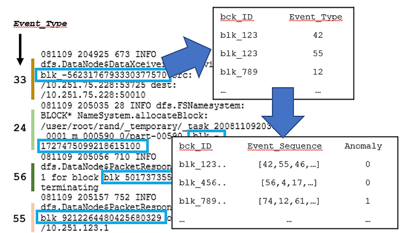
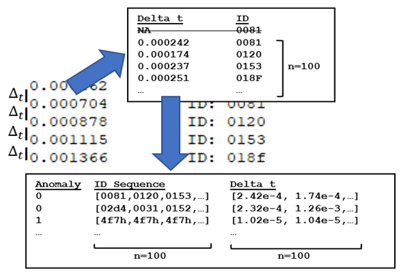

# A Log Anomaly Detection Project
 An initial exploration into anomaly detection on Hadoop distributed system and vehicle networking logs. 

For the curious minds, if you'd like more details and in-depth discussion, go here: 
- [The Value of Data-Centric Approaches to Log Anomaly Detection.pdf](https://github.com/lukavuko/Sequential-Feature-Log-Anomaly-Detection/blob/master/The%20Value%20of%20Data-Centric%20Approaches%20to%20Log%20Anomaly%20Detection.pdf)

### Problem Statement
Given a labelled system log file and/or sensor data, develop a feature extraction module for anomaly detection.

### Feature Extraction Philosophy
- To find an reliable predictor of anomalies, we need a feature that defines anomalies in log systems.
- Log anomalies aren't log events themselves but block IDs that don't behave as expected. 
- For example, a block ID "received" a packet of information and the subsequent event states the block ID is "receiving". This is contradictory as blocks cannot be receiving information after having received the information, thus is anomalous.
- Our primary feature should then relate to the sequence of events that takes places in a block instance.

### Model Philosophy
- A recurrant neural network should perform well on sequential data (in our case, event sequences). 
- As such, we'll explore the effectiveness of LSTMs in this project.

---

**A Hadoop distributed file system log screenshot:**

**An example of sequential feature extraction:**

---

**A car networking log example:**

**An example of a slightly adapted sequential feature extraction:**

